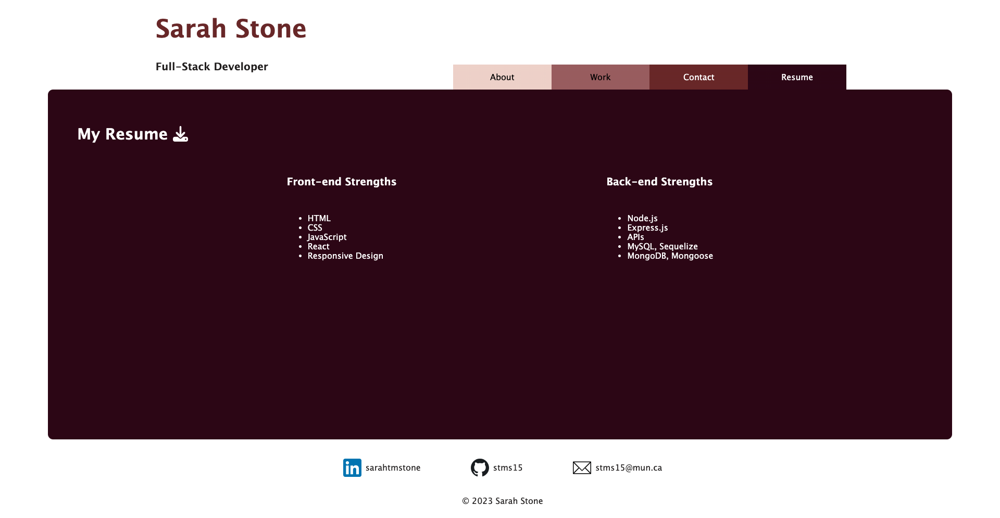

# React Portfolio

## Description

This project is a React website of my personal portfolio. The webpage only consists of a front-end and currently does not have a back-end.

The project allowed for extensive hands-on experience working with React.

## Table of Contents

- [Installation](#installation)
- [Usage](#usage)
- [Credits](#credits)
- [License](#license)

## Installation

N/A

## Usage

You can visit the site here: https://stms15.github.io/SarahStone-react-portfolio/ to view my portfolio.

You can use the tabs in the navigation to switch between pages. The pages included are:

1. About - this is a page all about me and my background.

2. Work - this page contains my previous work and websites and GitHub repos I've contributed to.

3. Contact - this page has a form to fill out to contact me, but this currently does not work as there is no back-end.

4. Resume - the title is a downloadable link of my current resume and the page also contains a list of my strengths.

There is also a footer where you will find my LinkedIn profile, GitHub account, and email address.

## Credits

This Stack Overflow thread was referrenced to make the description input field be able to handle multiple lines of input using `<textarea>`: https://stackoverflow.com/questions/6262472/multiple-lines-of-input-in-input-type-text.

The Font Awesome documents, this website https://fontawesome.com/v5/docs/web/use-with/react in particular, helped to incorporiate the download icon on the Resume page using React.

This blog post taught me how to properly deploy a React app to GitHub pages: https://blog.logrocket.com/deploying-react-apps-github-pages/.

## License

For more information about this license, please see the `LICENSE` file or visit https://spdx.org/licenses/MIT.html.

---

## Badges

